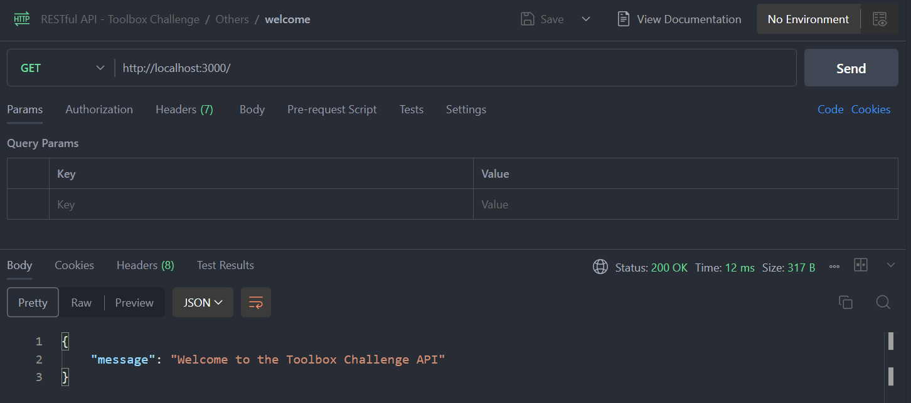
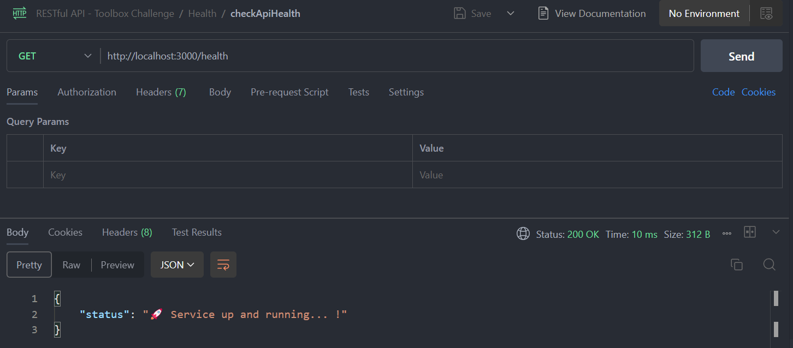
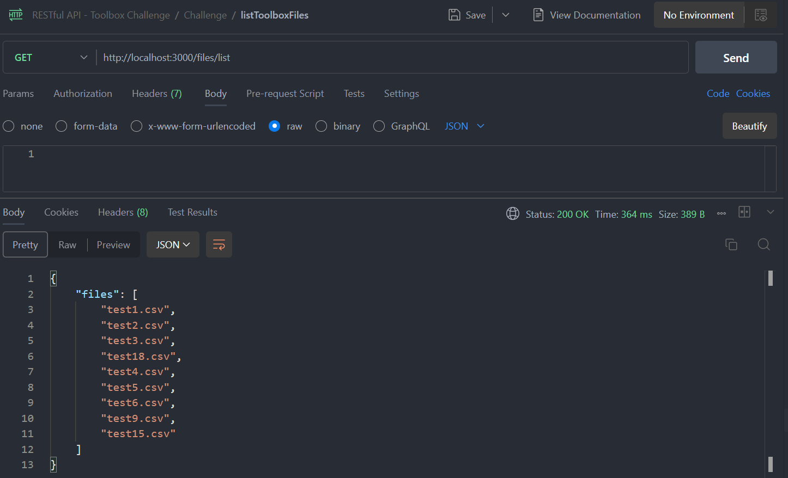
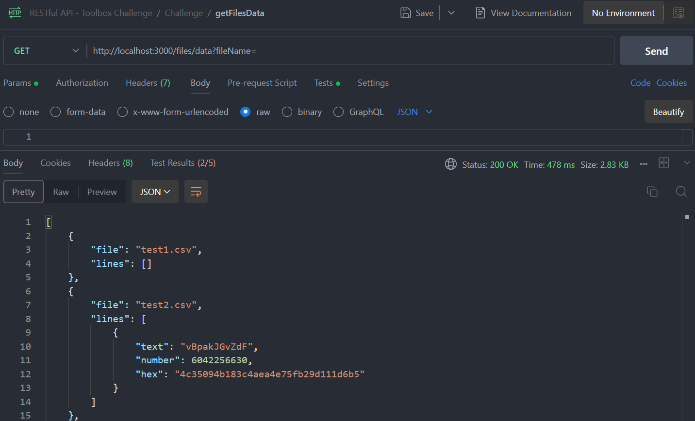
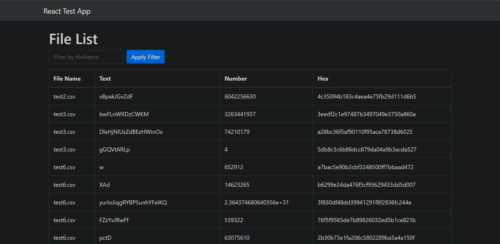
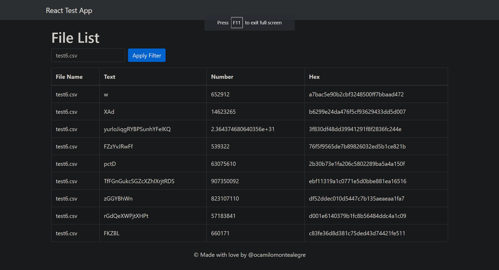

# Toolbox Challenge Documentation

## Introduction

Welcome to the Toolbox Challenge Documentation.

## API

  1. Implement logic for fetching and processing data files
  2. Expose Node.js app over the port 3000

### Api Endpoints
  1. /: return a welcome message
    

  2. /health: return app status
    

  3. /files/list: return the list of files from the toolbox secret API
    

  4. /files/data: return the formatted data from the obtained files
    

## Front
  1. Reflect the data fetched from the API /files/data endpoint as a table
    

  2. Allow user to search the data of an specific file
    
